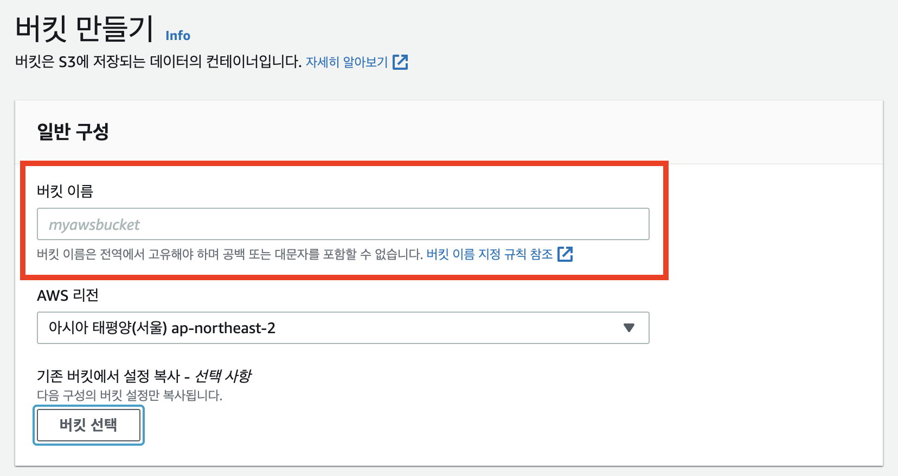
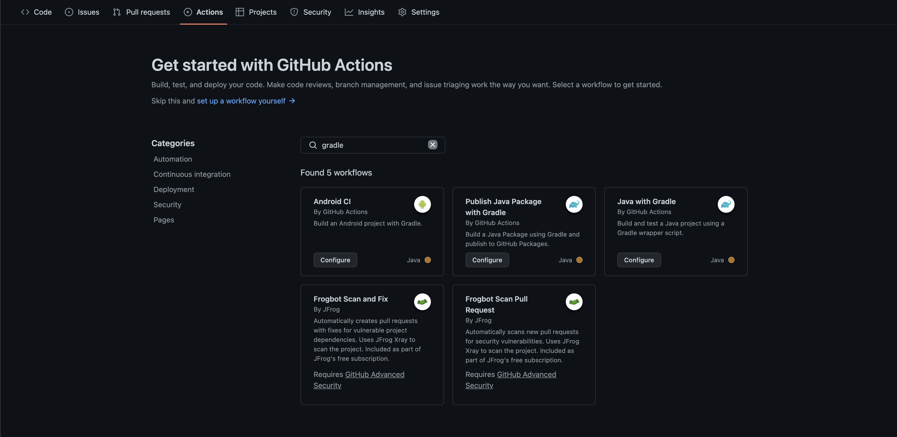
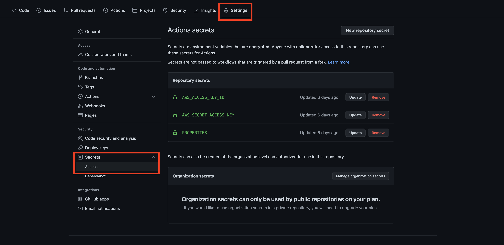

# 0. 전체적인 흐름
> 1. Github Action 설정을 통해 빌드 파일을 S3에 업로드 하고, CodeDeploy 를 실행함.
> 2. CodeDeploy 에서 EC2에 배포 실행하도록 명령.
> 3. 1단계에서 S3에 올려둔 필드 파일을 EC2에서 가져와 예약된 스크립트 실행.

# 1. S3 만들기
Github Action으로 만들어진 빌드 압축파일을 업로드 할 S3파일을 만들어주자.  

다른 설정들은 기본 옵션으로 두고 `버킷 이름`만 확인해두자. Github Action 설정 yml파일에 업로드할 S3 버킷 이름을 세팅해줘야 한다.

# 2. AWS EC2 서버에 CodeDeploy 설치
1. CodeDeploy 설치시 필요한 패키지 설치
```bash
sudo yum update
sudo yum install ruby
sudo yum install wget
```

2. 이전 에이전트 캐싱 정보의 AMI를 정리
```shell
#!/bin/bash
CODEDEPLOY_BIN="/opt/codedeploy-agent/bin/codedeploy-agent"
$CODEDEPLOY_BIN stop
yum erase codedeploy-agent -y
```
임시 shell 파일을 만들어서 실행해주자.

3. 파일 다운로드
```bash
cd /home/ec2-user

### wget https://{bucket-name}.s3.{region-identifier}.amazonaws.com/latest/install
### 아시아 태평양(서울)인 경우 예시
wget https://aws-codedeploy-ap-northeast-2.s3.ap-northeast-2.amazonaws.com/latest/install
```

4. 다운로드 파일 설치
```bash
chmod +x ./install
sudo ./install auto
```

5. 설치 확인 및 실행
```shell
### 상태확인
sudo service codedeploy-agent status

### 실행
sudo service codedeploy-agent start
```

`The AWS CodeDeploy agent is running`라는 메시지가 나오면 성공!


> CodeDeploy 설치 : https://docs.aws.amazon.com/ko_kr/codedeploy/latest/userguide/codedeploy-agent-operations-install-linux.html
> 리전별 리소스 키트 버킷 이름 : https://docs.aws.amazon.com/ko_kr/codedeploy/latest/userguide/resource-kit.html#resource-kit-bucket-names

AWS에서 서버별로 CodeDeploy 설치방법을 가이드하고 있다.
Amazon Linux 기준으로 세팅을 하였고, Ubuntu나 Windows 서버를 사용하고 있다면 참고 링크에서 찾아보면 간편하게 설치할 수 있다. 

# 3. Github Action 설정
1. yml파일 만들기.  
`{프로젝트 루트}/.git/workexamples/{파일이름}.yml`경로에 파일을 생성해야 Github에 소스가 올라갈때 Action 이벤트가 발생한다.  


`Github > repository > Action탭`에서 검색하여 템플릿을 활용하여 만들 수도 있고, 직접 해당 경로에 파일을 만들어서 commit 해도 작성해도 좋다.  

2. yml 예시.
```yml
name: Java CI with Gradle

on:
  push:
    branches: [ main ]
  pull_request:
    branches: [ main ]

env:
  AWS_REGION: ap-northeast-2
  S3_BUCKET_NAME: example-backend-bucket
  CODE_DEPLOY_APPLICATION_NAME: example-backend-codedeploy
  CODE_DEPLOY_DEPLOYMENT_GROUP_NAME: codedeploy-group


jobs:
  build:
    runs-on: ubuntu-latest
    steps:
    ### 1. 기본 체크아웃
    - name: Checkout
      uses: actions/checkout@v2

    ### 2. JDK 11 설정
    - name: Set up JDK 11
      uses: actions/setup-java@v1
      with:
        java-version: 11

    ### 3.properties 파일 생성.
    - name: make application-prod.properties
      if: true
      run: |
        cd ./src/main/resources
        echo "${{ secrets.PROPERTIES }}" > ./application-prod.properties
      shell: bash

    ### 4.gradlew 권한 생성.
    - name: Grant execute permission for gradlew
      run: chmod +x gradlew

    ### 5.빌드 시작
    - name: Build with Gradle
      uses: gradle/gradle-build-action@0d13054264b0bb894ded474f08ebb30921341cee
      with:
        arguments: clean build -x test

    ### 6. AWS 인증
    - name: Configure AWS credentials
      uses: aws-actions/configure-aws-credentials@v1
      with:
        aws-access-key-id: ${{ secrets.AWS_ACCESS_KEY_ID }}
        aws-secret-access-key: ${{ secrets.AWS_SECRET_ACCESS_KEY }}
        aws-region: ${{ env.AWS_REGION }}

    ### 7. S3 등록
    - name: Upload S3
      env:
        AWS_ACCESS_KEY_ID: ${{ secrets.AWS_ACCESS_KEY_ID }}
        AWS_SECRET_ACCESS_KEY: ${{ secrets.AWS_SECRET_ACCESS_KEY }}
      run: |
        aws deploy push \
          --application-name ${{ env.CODE_DEPLOY_APPLICATION_NAME }} \
          --ignore-hidden-files \
          --s3-location s3://$S3_BUCKET_NAME/$GITHUB_SHA.zip \
          --source .

    ### 8. CdoeDeploy 실행
    - name: Deploy to AWS EC2 from S3
      run: |
        aws deploy create-deployment \
          --application-name ${{ env.CODE_DEPLOY_APPLICATION_NAME }} \
          --deployment-config-name CodeDeployDefault.AllAtOnce \
          --deployment-group-name ${{ env.CODE_DEPLOY_DEPLOYMENT_GROUP_NAME }} \
          --s3-location bucket=$S3_BUCKET_NAME,key=$GITHUB_SHA.zip,bundleType=zip
```
`env`관련 변수들은 yml파일 상단에 선언후 사용하였고,

`secrets`변수들은 `Settins > Secrets > Actions'에 설정을 해두고 사용했다.

앞에서 살짝 언급했듯이 Github Action에서의 역할은 **Github 자체 서버에서 소스를 빌드**하고, 그 파일을 **압축하여 AWS S3에 업로드** 후 **AWS CodeDeploy를 실행**할 뿐이다.  

