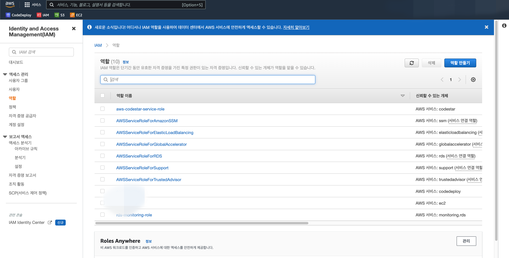
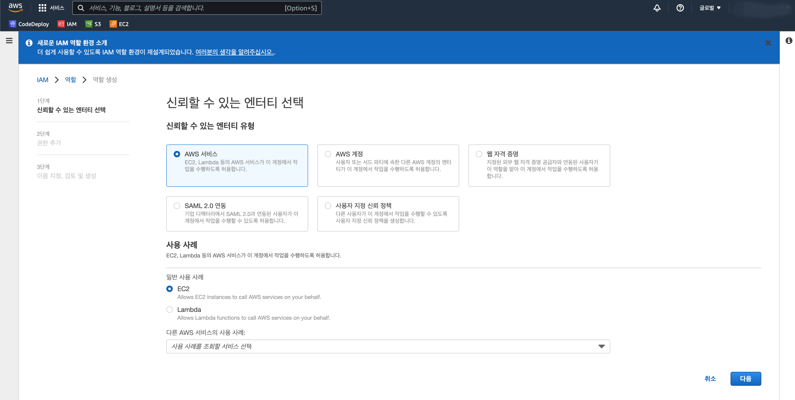
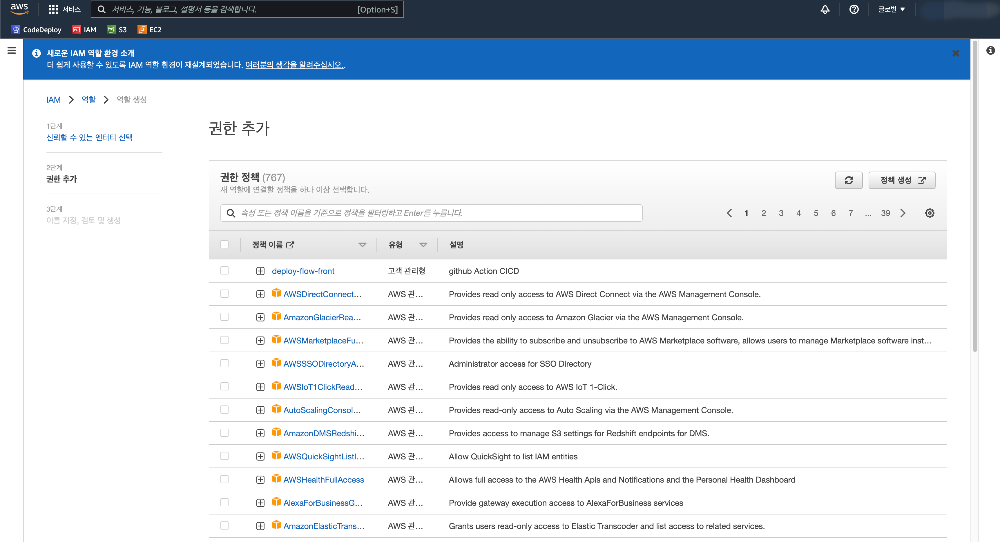
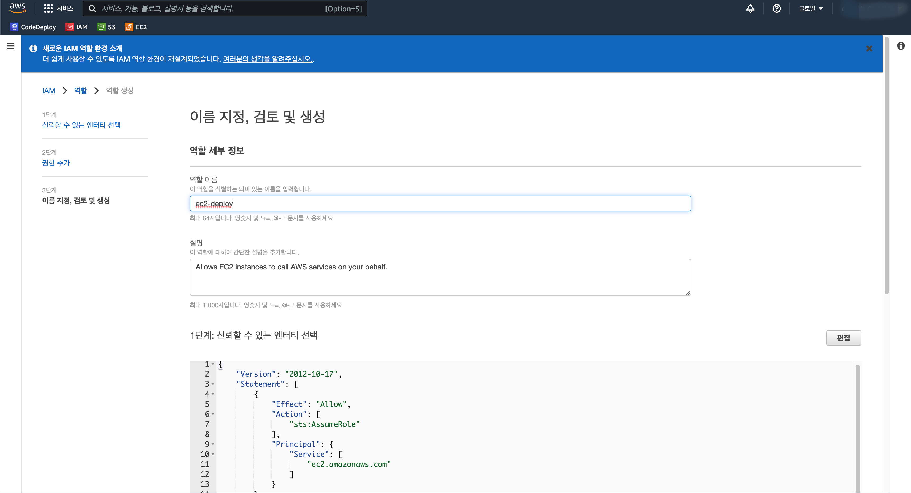
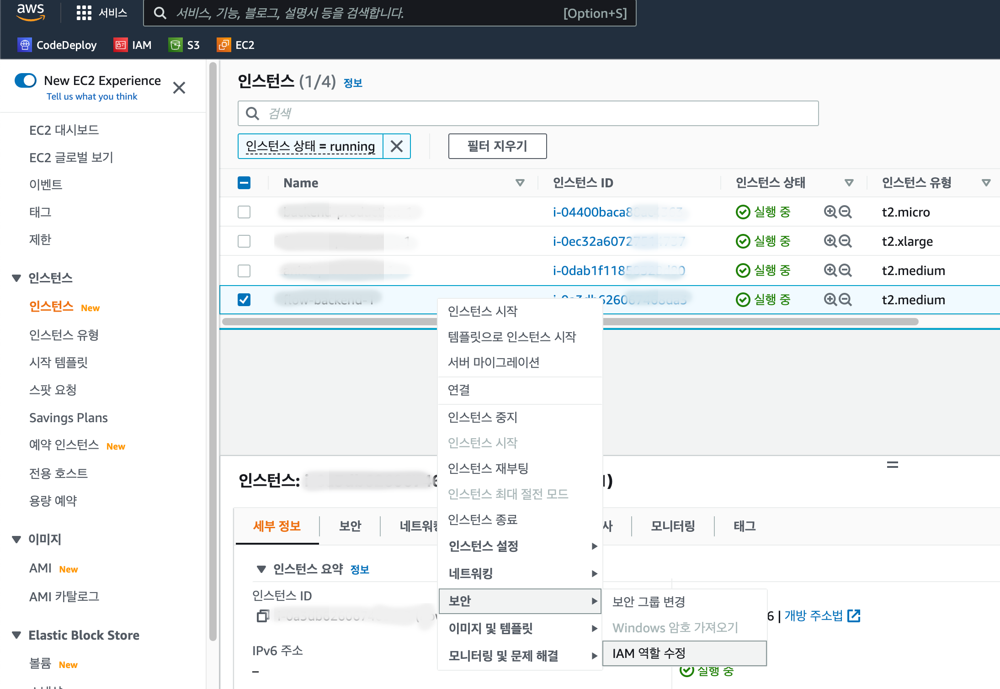
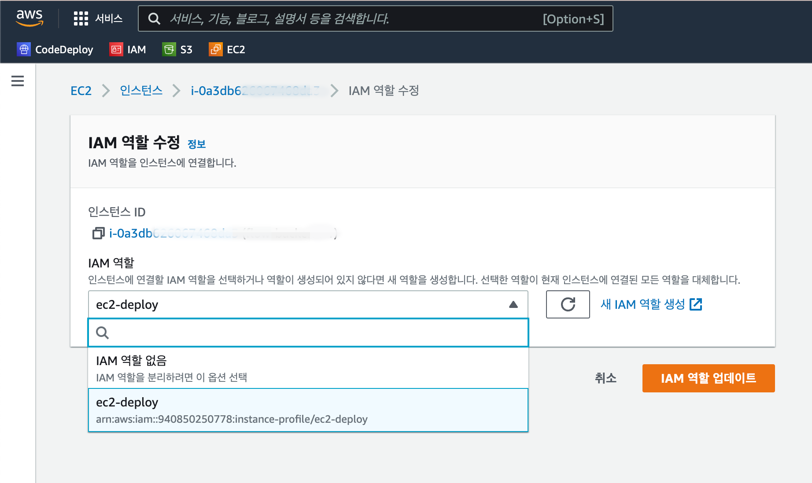
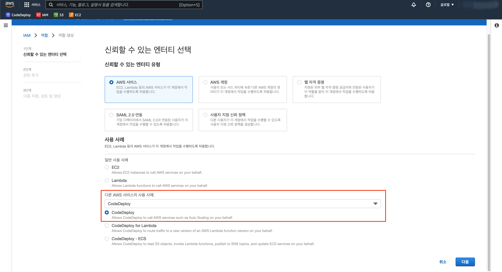
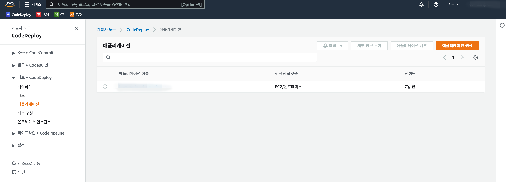
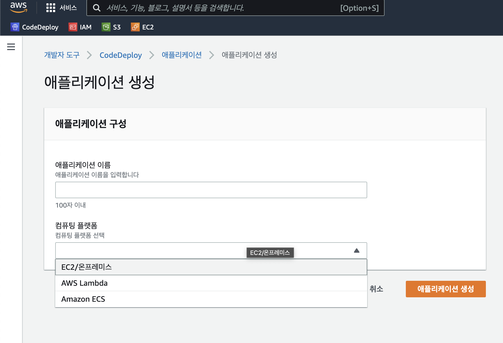

# 4. IAM 권한 설정
## (1) EC2 적용

> AWSCodeDeployFullAccess  
> AmazonS3FullAccess

두 가지 권한을 체크하여 역할을 만든다.  
역할 이름은 EC2에 권한 설정을 해줘야 하기 때문에 기억해두어야 한다.

위에서 만든 IAM 역할을 EC2 서버에 적용해주자.  

## (2) CodeDeploy 적용

이번에는 CodeDeploy에 적용할 IAM을 만들어야 하는데, AWS에서 서비스하는 CodeDeploy를 이용할 것이기 때문에 검색하여 선택해주고, <u>다음화면에서는 권한을 따로 체크해주지 않아도 된다.</u>

# 5. CodeDeploy 생성.

EC2 서버에 배포해줄 CodeDeploy를 만들어주자.

# 6. CodeDeploy 용 IAM 만들기
> IAM은 일종의 AWS 접속용 계정을 만들어주는 것으로 보면 될듯..

