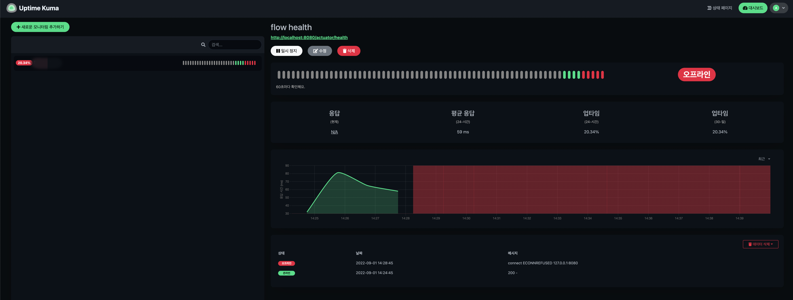
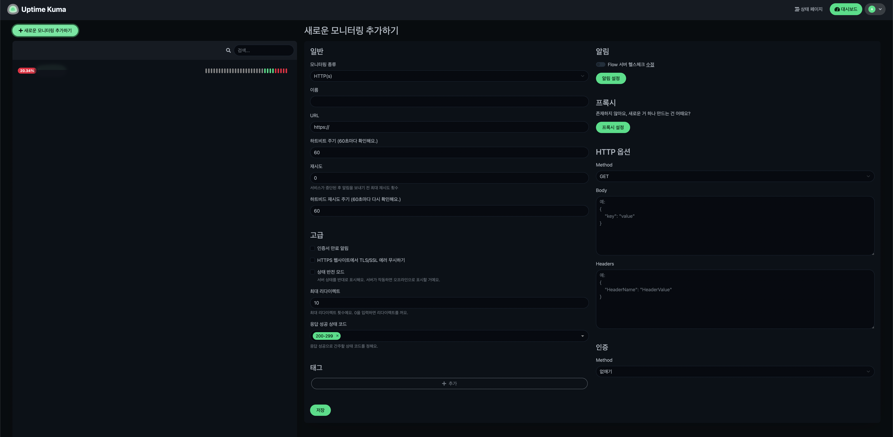
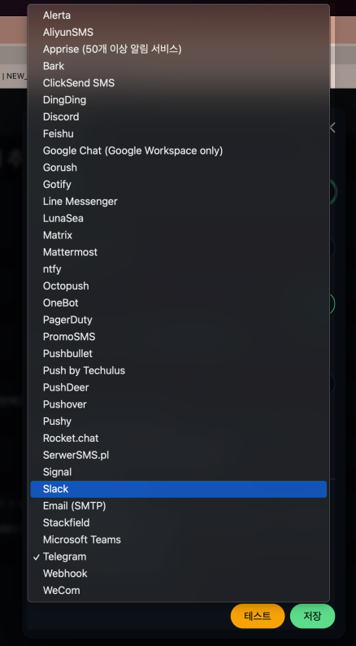

# 0. 개요
서비스가 많아지는데 일일이 헬스체크할 필요가 생겨났는데 어떻게 만드는게 좋을지 검색하던 참에 Spring Actuator라는 것을 알게 되었고, 추가적으로 uptime-kuma라는 오픈소스가 제공되고 있기에 이를 사용해서 헬스체크 서버를 만들어 보기로 하였다.  
~~이런 고마운 천재들...~~

# 1. Spring Actuator 설정
> https://incheol-jung.gitbook.io/docs/study/srping-in-action-5th/chap-16.

처음에는 서버가 정상적으로 잘 작동하고 있는지 요소들을 확인하여 기능별로 헬스체크용 api를 만들어두고 Client 서버에서 호출할 생각이었는데, Spring Actuator 의존성을 추가해주기만 하면 이런 기능들과 관련한 endpoint를 자동으로 제공해준다고 한다!!

## (1) Spring Actuator 의존성 추가
maven 추가
```xml
<dependency>
	<groupId>org.springframework.boot</groupId>
	<artifactId>spring-boot-starter-actuator</artifactId>
</dependency>
```

gradle 추가
```gradle
dependencies {
    implementation group: 'org.springframework.boot', name: 'spring-boot-starter-actuator', version: '2.6.11'
}
```

## (2) Spring Actuator에서 제공하는 Endpoint
| HTTP 메서드        | Endpoint        | 설명                                                                                  | 디폴트 활성화 |
|-----------------|-----------------|-------------------------------------------------------------------------------------|---------|
| GET             | /auditevents    | 호출된 audit event 리포트를 생성한다.                                                          | No      |
| GET             | /beans          | 애플리케이션의 모든 Spring Bean의 전체 목록을 표시.                                                  | No      |
| GET             | /conditions     | 성공 또는 실패했던 자동-구성 조건의 정보에 관한 정보.                                                     | No      |
| GET             | /configprop     | `@ConfigurationProperties` 정보                                                       | No      |
| GET,POST,DELETE | /env            | 스프링 애플리케이션에 사용할 수 있는 모든 속성 근원과 이 근원들의 속성을 알려준다.                                     | No      |
| GET             | /env/{toMatch}  | 특정 환경 속성의 값을 알려준다.                                                                  | No      |
| GET             | /health         | 애플리케이션의 상태 정보를 표시. 필수적으로 사용하는 엔드포인트.                                                | Yes     |
| GET             | /heapdump       | 힙(heap) 덤프를 다운로드한다.                                                                 | No      |
| GET             | /httptrace      | 가장 퇴근의 100개 요청에 대한 추적 기록을 생성한다.                                                     | No      |
| GET             | /info           | 개발자가 정의한 애플리케이션에 관란 정보를 반환한다.                                                       | Yes     |
| GET             | /loggers        | 애플리케이션의 패키지 리스트(각 패키지의 로깅 레벨이 포함된)를 생성한다.                                           | No      |
| GET,POST        | /loggers/{name} | 지정된 로거의 로깅 레벨(구성된 로깅 레벨과 유효 로깅 레벨 모두)을 반환한다.<br/>유효 로깅 레벨은 HTTP POST 요청으로 설정될 수 있다. | No      |
| GET             | /mappings       | 모든 HTTP 매핑과 이 매핑들을 처리하는 핸들러 메서드들의 내역을 제공한다.                                         | No      |
| GET             | /metrics        | 모든 메트릭 리스트를 반환한다.                                                                   | No      | 
| GET             | /metrics/{name} | 지정된 메트릭의 값을 반환한다.                                                                   | No      |
| GET             | /scheduledtasks | 스케줄링된 모든 태스크의 내역을 제공한다.                                                             | No      |
| GET             | /threaddump     | 모든 애플리케이션 스레드의 내역을 반환한다.                                                            | No      |

## (3) Endpoint 활성화 관리
(2) 에서와 같이 여러가지 Endpoint를 제공하고 있지만 별도의 설정이 없으면 `/health`와 `/info` 2개만 디폴트로 활성화가 되어있다.  
보안과 관련하여 민감한 정보가 포함될 수 있으므로 Spring Security나 보안정책을 잘 세워서 관리하도록 하자.

```yaml
management:
  endpoints:
    web:
      exposure:
        include: health,info,conditions
        exclude: env,beans,threaddump,heapdump
```

```shell
management.endpoints.web.exposure.include=health,info,beans,conditions
management.endpoints.web.exposure.exclude=env,beans,threaddump,heapdump
```
설정은 기존에 사용하던 `yaml`이나 `properties`파일에 추가해주면 된다.  
활성화 할 기능들은 `include`에, 비활성화 기능들은 `exclude`에 추가해주도록 하자.

## (4) Endpoint 호출해보기
지금까지의 설정을 마쳤다면 http://localhost:8080/actuator/info 등의 방법으로 호출하면 정상적으로 호출이 될 것이다.

```shell
management.endpoints.web.base-path=/checker
```
Spring Actuator에서는 `/actuator`를 기본 경로로 제공하고 있는데,  
다른 기본 경로를 사용하고 싶다면 위와 같이 설정을 해주고 서버 재기동을 하면 `~/checker/{endpoint}`로 커스텀 가능하다.


## (5) Application Health
### 1) Status
| Status | 설명                            |
|--------|-------------------------------|
| UP     | 시스템이 작동 중이고 접근 가능하다.          |
| DOWN   | 시스템이 작동하지 않거나 접근할 수 없다.       |
| UNKOWN | 시스템의 상태가 분명하지 않다.             |
| OUT_OF | 시스템에 접근할 수 있지만, 현재는 사용할 수 없다. |

### 2) 상세 health 정보.
```json
{
    "status": "UP"
}
```
`/health`에 대해 별도의 설정을 해주지 않는다면 `management.endpoint.health.show-details`의 디폴트 값이 `never`로 설정 되어 있기 때문에 DB나 다른 의존성이 추가된 정보에 관한 정보가 제공되지 않는다.

```shell
### 디폴트(상세X)
# management.endpoint.health.show-details=never

### 상세
management.endpoint.health.show-details=always
```
`always`로 값을 변경해주면 DB등 아래와 같이 상세 정보까지 조회 가능하다.
```json
{
  "status": "UP",
  "components": {
    "db": {
      "status": "UP",
      "details": {
        "database": "MariaDB",
        "validationQuery": "isValid()"
      }
    },
    "diskSpace": {
      "status": "UP",
      "details": {
        "total": 994662584320,
        "free": 833322774528,
        "threshold": 10485760,
        "exists": true
      }
    },
    "mail": {
      "status": "UP",
      "details": {
        "location": "smtp.gmail.com:587"
      }
    },
    "ping": {
      "status": "UP"
    }
  }
}
```

물론 위와 같이 상세 정보에서도 보안 또는 정책상 제거해야 하는 정보가 있으면 그 부분만 비확성화도 가능하다.  
아마 `management.health.`이후로 자동 완성되어 확인 가능할 것이다.
```shell
# management.health.{제외할 의존성 이름}.enabled=false
management.health.mail.enabled=false
```

이렇게 하면 mail에 대한 health 정보는 받아볼 수 없다.

> - 참고 : https://forward.nhn.com/2021/hands-on-labs/java.spring-boot-actuator/06-health.html

## (6) 그 밖의 Custom Endpoint 설정
추후 보완 예정..

# 2. Uptime Kuma 소개
## (1) 간략한 소개
Spring Actuator로 서버 상태를 알 수 있는 간단한 api를 만들었다면, 이를 주기적으로 호출해서 서버의 상태가 정상인지 확인하는 서버를 만들어야할 것이다.  
이런 귀찮은 것들을 한번에 해결해줄 강력한 라이브러리가 있어서 짧게 소개해본다.
- 한글지원
- 간편한 설정
- 다양한 알람 기능
- vue 기반의 시각화 페이지
등등..







## (2) 설치
> https://github.com/louislam/uptime-kuma

## (3) 사용법
설치부터 시동법 까지 `README.md`에 자세하게 나와있어서 간단하게 사용하는 방법이 소개되어 있다.  
현재 상황에서는 api 헬스체크후 이상시 Slack으로 알람을 보내는 것이 목적이기에 간편하게 설정할 수 있었다.  
~~하지만 node와 친하지 않아서 정확한 작동 방법은 좀 더 스터디를 해봐야할 것 같다..~~
